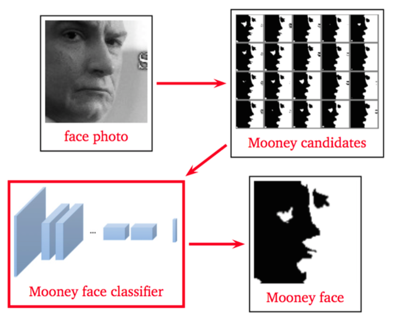
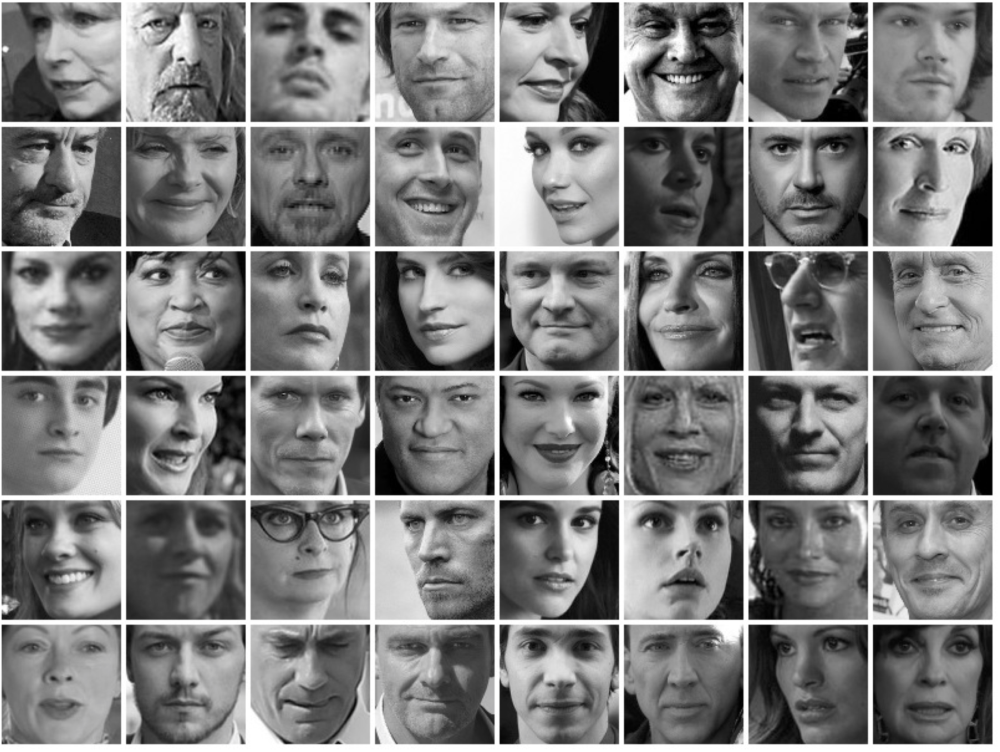
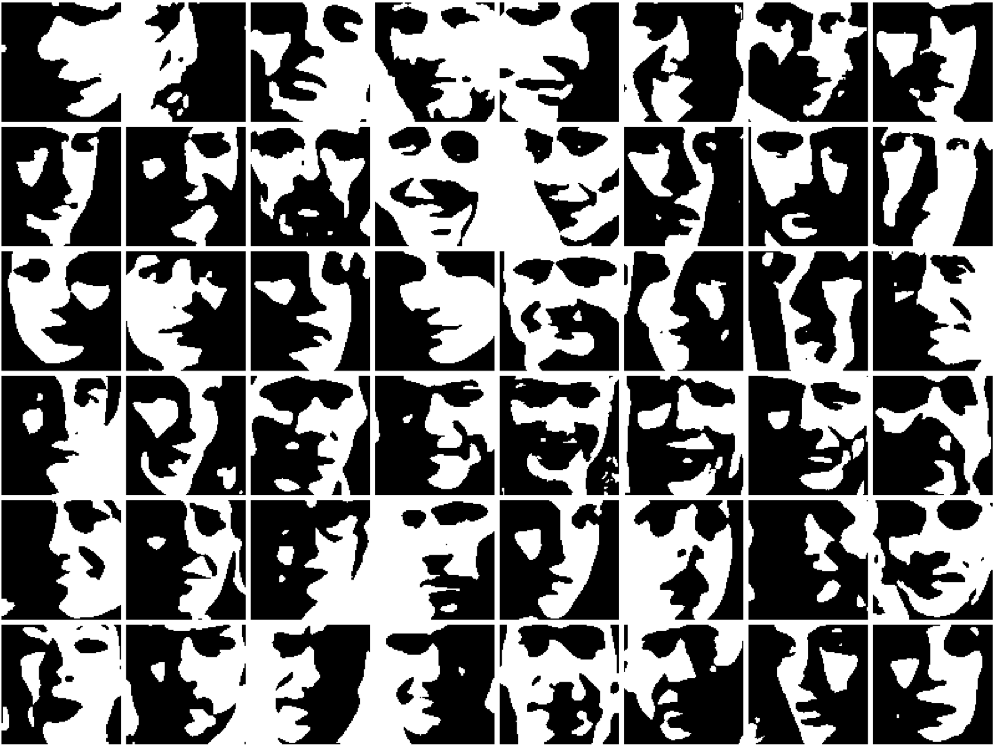

# MooneyFaceGenerator
A Deep Learned Model for Generating Mooney Faces from Face Dataset

            

Mooney Face Classification and Prediction by Learning across Tone

[Tsung-Wei Ke](https://www1.icsi.berkeley.edu/~twke/), [Stella X. Yu](https://www1.icsi.berkeley.edu/~stellayu/), [David Whitney](https://whitneylab.berkeley.edu/david_whitney.html)

Mooney faces are special two-tone image, and researchers believe that these images might contain essential element of facial structure which helps huma to percept faces. However, researcher are also bothered with two issues: 1) only small number of Mooney faces available, 2) source photos of these Mooney images are lost.

To address these issues, we propose two models:

1. **Mooney faces generator**
2. **Binary-to-Grayscale images predictor**

We provide source code of **Mooney faces generator** in this repository, and we train a [Pix2Pix GAN](https://phillipi.github.io/pix2pix/) as **Binray-to-Grayscale images predictor**.

## Mooney faces generator

### Prerequisites
* Linux
* NVIDIA GPU + CUDA +CUDNN

### Getting Started
* Install [torch and dependencies](https://github.com/torch/distro)
* Install torch packages `cudnn`, `dpnn`, `hdf5`

```
> luarocks install cudnn
> luarocks install dpnn
> luarocks install hdf5
```

* Clone this repo
```
> git clone https://github.com/buttomnutstoast/MooneyFaceGenerator.git
> cd MooneyFaceGenerator
```

### Prepare the datasets
Put the downloaded datasets to `$DATA_ROOT/`. The folder structure should be in the format like
```
DATA_ROOT/
    |------FaceScrub/
    |         |--------Img/
    |         |--------img_list.txt
    |
    |------ILSVRC/
    |         |--------Img/
    |         |--------revImg/
    |         |--------img_list.txt
    |         |--------rev_img_list.txt
    |
    |------Mooney/
    |         |--------Img/
    |         |--------revImg/
    |         |--------vflipImg/
    |         |--------vflipRevImg/
    |         |--------img_list.txt
    |         |--------rev_img_list.txt
    |         |--------vflip_img_list.txt
    |         |--------vflip_rev_img_list.txt
        ....
 ```

* Download Cropped and Aligned Facescrub Dataset provided by [MegaFace](http://megaface.cs.washington.edu/participate/challenge.html)
```
> Need to be finished
```

### Train the Mooney face classifier
We first fine-tune the facial recognition model by [openface](https://cmusatyalab.github.io/openface/) for grayscale face classification. You can download the model from [here](https://www1.icsi.berkeley.edu/~twke/data/mooney_icip2017/nn4small2v1_gray_face.t7) and then fine-tune it to mooney face classifier. Put the downloaded model to `$TRAINED_MODEL_PATH`.
```
> DATA_ROOT=/path/to/root/dir/of/datasets TRAINED_MODEL_PATH=/path/to/gray/face/models sh scripts/mooney_train.sh
```
The new learned model would be save to `checkpoint/mooney_train/OPTION_ARGS/TIME_AND_DATE/model_20.t7`

### Generate Mooney faces
Set `$TRAINED_MODEL_PATH` to the trained mooney classifier (such as checkpoint/mooney_train/OPTION_ARGS/TIME_AND_DATE/model_20.t7).
```
> DATA_ROOT=/path/to/root/dir/of/datasets TRAINED_MODEL_PATH=/path/to/mooney/face/models sh scripts/mooney_train.sh
```
The results will be saved into a hdf5 file which would be located at `checkpoint/facescrub_mooney/OPTION_ARGS/TIME_AND_DATE/testOutput_1.h5`


### Filter most-likely Mooney candidates from each images
Set `$HDF5_RESULT` to the filepath of hdf5 file generate in the previous step.
```
> HDF5_RESULT=/path/to/hdf5/result th scripts/filter_by_mooneyness.lua -hdf5 $HDF5_RESULT
```

## Binary-to-Grayscale images predictor

### Setup
Please follow the instruction and download Pix2Pix GAN from [https://github.com/phillipi/pix2pix](https://github.com/phillipi/pix2pix).

### Dataset prepration
You can,

1. Use the faces generated from [here](https://github.com/buttomnutstoast/MooneyFaceGenerator/blob/master/README.md#generate-mooney-faces)
2. Download our dataset from [here](https://www1.icsi.berkeley.edu/~twke/data/mooney_icip2017/mooney_facescrub.tar)

---

## Acknowledgements
We borrow code heavily from [Soumith](https://github.com/soumith/imagenet-multiGPU.torch). We fine-tune the model `nn4small2v1` trained by [openface](https://cmusatyalab.github.io/openface/) to mooney face classifier. We use the cropped and aligned Facescrub Dataset provided by [MegaFace](http://megaface.cs.washington.edu/). Our ground-truth mooney faces are provided by [David](https://whitneylab.berkeley.edu/david_whitney.html) and [PICS](http://pics.stir.ac.uk/).
